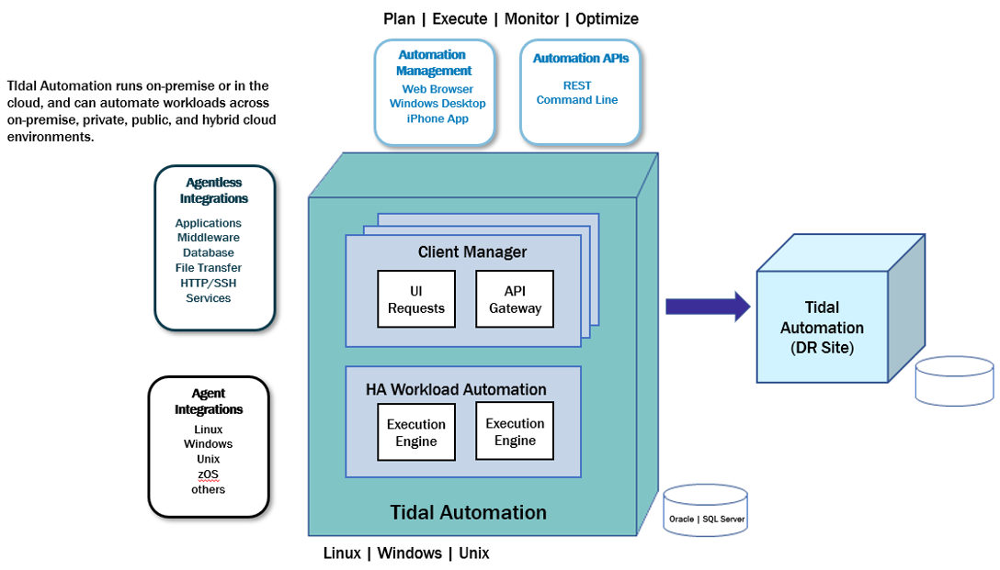

# About Tidal agents

Companies often need to provide centralized scheduling and administration of workloads that span different computing plaforms, multiple machines, and multiple locations. Tidal Automation uses agents to run jobs on the platforms where they need to run.

 A Tidal Automation™ network contains a primary instance called the TA Master and additional instances of Tidal Automation called agents. A TA Master can schedule jobs on these agents for execution, while the TA Master to focus on managing workload schedules. Agents also monitor the local environment and feeds the information back to the TA Master to better determine when customer applications are ready to be run. Tidal Automation supports agents for the following environments:

- Windows
- Java-based Unix/Linux
- OpenVMS
- z/Os

The platform support for agents is documented in _Tidal Automation Compatibility Matrix_.

Agent-specific documentation is provided for these agents:

- _OpenVMS Agent Guide_
- _z/OS Agent and Gateway Adapter Guide_

In the basic TA network, the Master uses a centralized database containing all calendar and job scheduling information. One or more agent machines execute the production schedule. One or more client machines provides the TA user interface or console. The only prerequisite for the Master/agent relationship is that the machine acting as the Master must be on the same TCP/IP network as the machines serving as agents.

Agents:

- Run on behalf of the TA Master
- Monitor file events and dependencies
- Communicate data back to the TA Master

!!! note
    Tidal recommends that no more than five agents be run on the minimum hardware platform. However, the number of agents that can be run on a given server depends upon the CPU and memory resources available on the machine. Add a single agent at a time and gauge the effect of each added agent on system performance before adding more. You have to experiment with the configuration to achieve optimal results.
