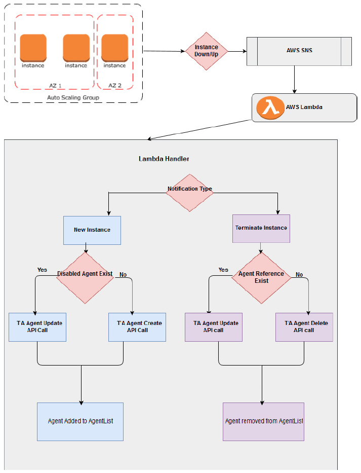

# Using agent lists with Amazon Web Service Auto Scaling

Amazon Web Service (AWS) Auto Scaling monitors your applications and automatically adjusts the capacity to maintain steady, predictable performance at the lowest possible cost. Using AWS Auto Scaling, you can setup application scaling for multiple resources across multiple services in less time.

When a new agent machine is launched in the Amazon Web Service (AWS) with Auto Scaling group enabled, the agent is created and added to agent lists in TA. Similarly, when the existing AWS agent machine is removed or terminated from the AWS Auto Scaling group, the agent gets deleted and removed from the agent lists. This process is done automatically using the following AWS components:

* Auto Scaling Group
* AWS Simple Notification Service
* AWS Lambda function

The following block diagram explains the process involved in registering and unregistering agents with the agent list and TA Master.



## Creating an AWS Auto Scaling group
Autoscaling helps to ensure that the correct number of instances are available to handle the load for the application. The collections of instances are created and called the Autoscaling groups. The maximum or minimum number of instances are specified in each group. Autoscaling ensures that the group never goes above or below the values set.

For more information on creating the Autoscaling Group, see the following link:

[https://docs.aws.amazon.com/autoscaling/ec2/userguide/create-asg.html](https://docs.aws.amazon.com/autoscaling/ec2/userguide/create-asg.html)


## Getting AWS Simple Notification Services messages
A topic is a communication channel to send messages and subscribe to notifications. A topic name is used to create a permanent unique identifier called an Amazon Resource Name (ARN).

To create a new topic:

1. In the Amazon SNS console, select **Create topic**.

    The **Create topic** dialog box appears. 

1. In the **Topic name** field, enter the topic name.
1. In the **Display name** field, enter the topic display name. This display name is required for topics with SMS subscriptions.
1. Select **Create topic**.

    The new topic appears.

To receive messages published to a topic, you have to subscribe an endpoint to that topic. An endpoint is a mobile app, web server, email address, or an Amazon SQS queue that can receive notification messages from Amazon SNS. Once you subscribe an endpoint to a topic and the subscription is confirmed, the endpoint will receive all messages published to that topic. You configure the subscription to send the topic messages to your email account. 

To create subscription:

1. In the Amazon SNS console, select **Create subscription**.

    The **Create Subscription** dialog box appears.

1. Enter the topic ARN.
1. From the **Protocol** drop-down list, select **AWS Lambda**.
1. From the **Endpoint** drop-down list, choose an email address you can use to receive the notification.
1. Select **Create subscription**.

Go to your email application and open the message from AWS Notifications, and select the link to confirm your subscription. Your web browser displays a confirmation response from Amazon SNS.

For more information on creating the topic and subscribe topic, see the following links:

* [https://docs.aws.amazon.com/sns/latest/dg/CreateTopic.html](https://docs.aws.amazon.com/sns/latest/dg/CreateTopic.html)
* [https://docs.aws.amazon.com/sns/latest/dg/SubscribeTopic.html](https://docs.aws.amazon.com/sns/latest/dg/SubscribeTopic.html)


## Creating a lambda function
A Lambda function is created to handle the launching of an instance or termination of an instance.

For more information on creating the Lambda function, see the following link:

[https://docs.aws.amazon.com/lambda/latest/dg/get-started-create-function.html](https://docs.aws.amazon.com/lambda/latest/dg/get-started-create-function.html)


## Lambda handler
When the instance is up/down, the Lambda Handler receives the AWS SNS messages during launch or termination of the instance. 

The Lambda handler reads the SNS notification message in the Lambda code, fetches the instance details, and calls the TA API call based on the instance notification type.

If the notification type is **New Instance**, it checks whether the agent already exists. Then:

* If the prefix of the agent name matches with the existing agent name and the agent is disabled, the latest data is updated to that existing disabled agent while creating the new instance in AWS. 
* If the IP of the agent matches with the existing agent and the agent is disabled, the latest data is updated to that existing disabled agent while creating the new instance in AWS.

If the notification type is **Terminate Instance**, it checks whether the agent references with other objects like job. If there is a reference with other objects, the agent is disabled instead of deleting the agent while removing the instance from AWS account.

## Setting up an AWS environment
Before using AWS Autoscaling, you must set up an AWS environment.

To set up an AWS environment:

1. Create a new Amazon Machine Image (AMI) with Unix/Window TA agent. 

    For more information on creating AMI, see the following link:

    [https://docs.aws.amazon.com/AWSEC2/latest/UserGuide/creating-an-ami-ebs.html](https://docs.aws.amazon.com/AWSEC2/latest/UserGuide/creating-an-ami-ebs.html)

    If you already have the AMI with the TA agent, move to the next step.

1. Create a Lambda function to handle the launching or termination of instance and upload the **AgentListAutomation.jar** file. 
1. Select the following Lambda Handler in the **Handler** text box:

    “**com.tidal.automation.AgentListLambdaFunctionHandler**”

1. Select a memory size of at least 512 MB.
1. Choose the **Timeout** value based on Lambda running time (suggested value is 5 minutes).
1. Choose the appropriate Lambda Role.

    [https://docs.aws.amazon.com/IAM/latest/UserGuide/id_roles.html?icmpid=docs_iam_console](https://docs.aws.amazon.com/IAM/latest/UserGuide/id_roles.html?icmpid=docs_iam_console)

1. Create AWS SNS notifications and subscribe with the Lambda function created in Step 2.
1. Create an **Autoscaling Launch Configuration**.

    For choosing the required configuration with the corresponding AMI, choose the **IP Address Type** as **Assign a public IP address** for every instance.

    [https://docs.aws.amazon.com/autoscaling/ec2/userguide/LaunchConfiguration.html](https://docs.aws.amazon.com/autoscaling/ec2/userguide/LaunchConfiguration.html)

1. Create the Autoscaling group and map it with the created SNS. Note that the Virtual Private Cloud (VPC) ID must be the same as the CM VPC.

## Client Manager configuration properties

The following table provides the list of Client Manager (CM) properties supported in the **AgentListAutomation.jar** file.

| Property Name | Required? | Description |
| ------------- | :---------: | ----------- |
|active||Whether the agent list is active (default: Y)|
|agentlistid|Y|ID of the TA agent list. Multiple IDs can be given with comma separated.|
|cm_dsppluginname||Plugin name (default: "tes-6.5").|
|cm_password|Y|Client Manager password.|
|cm_servername|Y|IP address of the Client Manager.|
|cm_serverport | | Server port number (default: 8080).|
|cm_username | Y | Username of the Client Manager.|
|description||User-defined description (default: "Agent created by AWS Lambda with AWS Autoscaling group").|
|iptype||Type of IP address (default: "public")<ul><li>**public**: Agent machine IP address is a public IP address</li><li> **private**:  Agent machine IP address is a public IP address (i.e. within the subnet IP range)</li></ul>|
|maxjoblimit||Maximum number of jobs that can be run in an agent list (default: 10).|
|nameprefix||Agent name prefix (default: "AWS_AGENT").|
|ostype|Y|Type of operating system used by TA.|
|port||Agent machine's port number (default: 5912).|
|runtimeuserid||TA runtime user ID (default: 0).|

## AWS configuration properties
The following table provides the list of AWS properties.

|Property Name|Required?|Description|
|---|:---:|------------------------------|
|accesskey|Y|AWS access key.|
|secretkey|Y|AWS secret key.|
|Uselambdavariable||Whether to use a Lambda variable (default: Y).<br><ul><li>**Y**: All properties are loaded from **automation.props** file and also any property can be overridden through the Lambda environment variable. Note that the CM password must be encrypted by Key Management Service (KMS) key, and other property should not be encrypted.<br><br>For more information on KMS creation, see the following link:<br><br>[https://docs.aws.amazon.com/kms/latest/developerguide/create-keys.html](https://docs.aws.amazon.com/kms/latest/developerguide/create-keys.html)</li><li>**N**: All properties are loaded from **automation.props** file. The AWS Lambda environment variable option is not available for this condition.</li></ul>|

!!! tip
    For security reasons, use read-only user access key and secret key. 

To create the user access key in the AWS management console:

1. In the **Navigation** panel of the Identity Access Management (IAM) console, choose **Users**.

    The list of users having read only access permission is displayed. If you want to add a new user, choose **Add user**.

1. Select the desired user.
1. Select the **Security Credentials** tab and select **Create access key**.

    The user access key is created.

For more information on access key creation, see the following link:
[https://docs.aws.amazon.com/IAM/latest/UserGuide/id_credentials_access-keys.html](https://docs.aws.amazon.com/IAM/latest/UserGuide/id_credentials_access-keys.html)

For security reasons, add KMS key decrypt inline policy for read only user. The following example provides the sample policy JSON file:

```
{
    "Version": "2012-10-17",
    "Statement": [
        {
            "Sid": "VisualEditor0",
            "Effect": "Allow",
            "Action": "kms:Decrypt",
            "Resource": "arn:aws:kms:<region>:<AWS AccountId>:key/<KMS key Id>"
        }
    ]
}
```