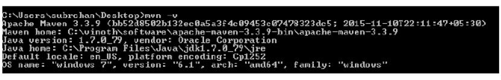
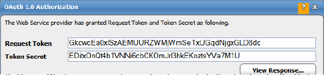

# Installing Hadoop client libraries

Hadoop client libraries are required for processing the Hadoop-related DataMover, Hive, MapReduce, and Sqoop jobs. As of TA 6.5.5, Hadoop libraries are not included with TA . Instead, we provide a Maven script (**POM.xml**) to install the required libraries.

If you do not already have Maven, you must download and install it. Obtain the **POM.xm**l file from the folder/directory named **Hadoop** on the CD and run the file script to download the required Hadoop client libraries. Instructions for obtaining Maven and downloading the Hadoop libraries are included in these sections:

* [Installing Maven](#installing-maven)
* [Downloading the Hadoop client library](#downloading-the-hadoop-client-libraries)

!!! note
    This section includes instructions for intalling Hadoop client libraries on Windows.

## Installing Maven
Before installing Maven, your system must meet the following prerquisites:

* JDK must be installed.
* The JAVA_HOME environment variable must be set and point to your JDK.

To download and install Maven:

1. Download Maven 3 or above from [https://maven.apache.org/download.cgi](https://maven.apache.org/download.cgi).
2. Unzip **apache-maven-<3-or-above>-bin.zip**.
3. Add the **bin** directory of the created directory (for example, **apache-maven-3.3.9**) to the **PATH** environment variable.
4. Confirm a successful Maven installation by running the **mvn -v** command in a new shell. The result should look similar to the following: 

    

## Downloading the Hadoop client library

With Maven installed, you can now download the Hadoop client library. Maven scripts (**POM.xml**) are provided for the following distributions of Hadoop.

| Hadoop Distribution Type | Versions |
| --- | --- |
| Cloudera | CDH5 |
| Hortonworks | HDP 2.4.x |
| MapR | 5.1.0 |

!!! note
    The _Tidal Automation Compatibility Matrix_ contains the most current version information.

To download and install the Hadoop client library:

1. Download the **POM.zip** file. This file is provided in the **/Hadoop** directory in the TA 6.5.6 distribution package.
1. Unzip the **POM.zip** file. 

    The POM xml files needed by Maven are saved in the directory structure as shown: 

    

1. Open a Windows command prompt and navigate to the directory for the Hadoop distribution in which you are interested. For example, navigate to the **CDH** directory if you want to download Hadoop client libraries for Cloudera.

1. Edit the **POM.xml** file to mention exact versions of MapR, Hadoop, Hive, and Sqoop that you are using. For example, for Cloudera the required properties could be edited as shown below:

    <pre>
	&lt;properties&gt;
	    &lt;Hadoop.version&gt;2.6.0-cdh5.6.0&lt;/Hadoop.version&gt;
	    &lt;Hive.version&gt;1.1.0-cdh5.7.0&lt;/Hive.version&gt;
	    &lt;Sqoop.version&gt;1.4.6-cdh5.6.0&lt;/Sqoop.version&gt;
	&lt;/properties&gt;
    </pre>

    For MapR, you must also include the version of MapR used, as shown in the  following example:

    <pre>
    &lt;properties&gt;
        &lt;Hadoop.version&gt;2.7.0-mapr-1602&lt;/Hadoop.version&gt;
        &lt;Hive.version&gt;1.2.0-mapr-1605&lt;/Hive.version&gt;
        &lt;Sqoop.version&gt;1.4.6-mapr-1601&lt;/Sqoop.version&gt;
        &lt;Mapr.version&gt;5.1.0-mapr&lt;/Mapr.version&gt;
    &lt;/properties&gt;
    </pre>

1. From the directory containing the Hadoop distribution you want, execute this command:

    `mvn dependency:copy-dependencies -DoutputDirectory=<jar-download-directory>`

    For example, running the following command from the **CDH** directory:

    `mvn dependency:copy-dependencies -DoutputDirectory=C:\CDHlib`

    would insert the Cloudera Hadoop client libraries to the **C:\CDHlib** directory. 

