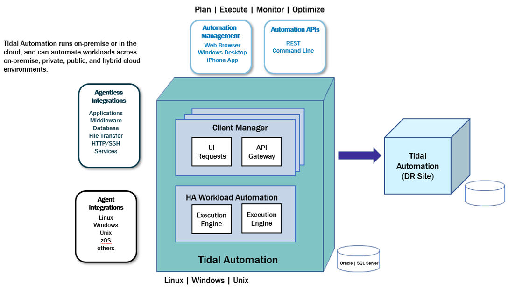
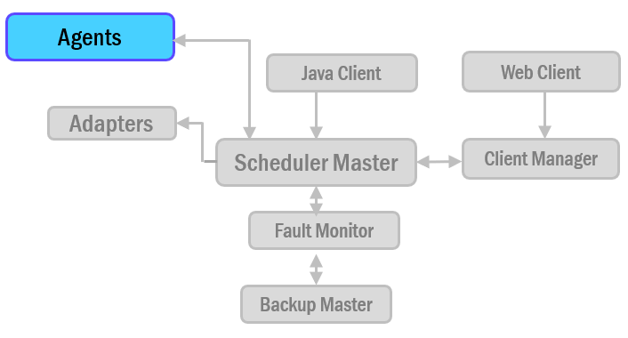

# About agents

Companies often need to provide centralized scheduling and administration of workloads that span multiple machines
and multiple locations. TA Master/agent architecture provides that capability.

An agent is a separate installation component of Tidal Automation that runs jobs on behalf of the Master. Offloading jobs to agents frees the Master for intensive scheduling tasks such as production compiles. Agents exist for various platforms including Windows, Unix, z/OS and OpenVMS environments. Check with your sales representative for the current list of the types of agents available.

## Agents in a Tidal network

In the basic TA network, the Master uses a centralized database, containing all calendar and job scheduling information. One or more agent machines execute the production schedule. One or more client machines provides the TA user interface or console. The only prerequisite for the Master/agent relationship is that the machine acting as the Master must be on the same TCP/IP network as the machines serving as agents.

Agents:

* Runs on behalf of the TA Master
* Monitors file events and dependencies
* Communicates data back to the TA Master

__Warning__: It is recommended that no more than five agents be run on the minimum hardware platform. However, the number of agents that can be run on a given server depends upon the CPU and memory resources available on the machine. Add a single agent at a time and gauge the effect of each added agent on system performance before adding more. You have to experiment with the configuration to achieve optimal results.

## Platform support for agents

TA provides agents for Windows, Unix, z/OS and OpenVMS environments. The platform support for agents is
documented in TA Compatibility Matrix.

Agent-specific documentation is provided for these agents:

- OpenVMS
- z/OS

__Regulatory__: It is recommended that no more than five agents be run on the minimum hardware platform. However, the number of agents that can be run on a given server depends upon the CPU and memory resources available on the machine. Add a single agent at a time and gauge the effect of each added agent on system performance before adding more. You have to experiment with the configuration to achieve optimal results.