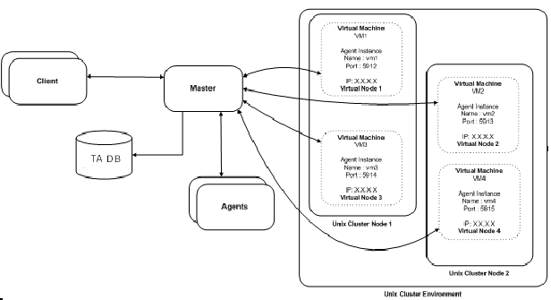
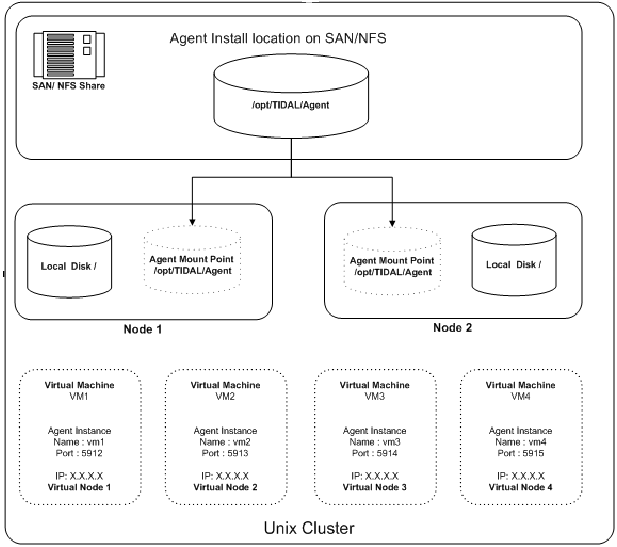

# Configuring a cluster to run a Java-based agent

A Java-based agent can run in a Unix cluster environment. 

The following diagram illustrates how Tidal Automation is configured in an environment with Unix cluster.



The TA Master component connects to agent instances associated to a virtual machine using the virtual machine name and IP address and the port number. This allows the TA Master to maintain the agent connection when the cluster management software moves the virtual machine to another participating node.

## Prerequisites

To configure the TA Agent for Unix on a cluster to follow the virtual machine, the following prerequisites must be met:

* The SAN/NFS agent installation location must be mounted at the same mount point on all of the cluster nodes.
* Java Virtual Machine (JVM) prerequisites must be installed on all of the nodes. These prerequisites for the JVM include installing all OS patches, maintaining kernel parameters, etc.
* The same JVM must be installed on each of the physical nodes (and, whenever possible, the JVM should be installed in the same directory location on each of the nodes.)
* The agent owner account must be accessible from all of the nodes.
* The minimum requirements for the TA agent must be met on each of the individual nodes.
* The installation and configuration of TA Agents for Unix in a cluster can be broken down into the following four steps:
    - Installing agent files on the SAN/NFS mount location.
    - Configuring agent instances (only one instance per virtual machine).
    - Configuring the cluster virtual machine.
    - Configuring TA to connect to the agent instances on a virtual machine.

## Installing agents on a SAN/NFS location


To install the agent on the SAN/NFS location:
1. Using FTP, copy the agent installation files to one of the participating nodes in the cluster. 

2. Login as root to the same physical node where the agent installation files were copied.

3. Change to the directory where the agent installation files were copied.

4. Follow the normal agent installation procedure that is described in the Installing Windows agents, page 4, with the following exceptions:

    * When entering a location for the agent files, select the SAN/NFS location (visible to all the nodes).
    * Ensure that the agent owner is a NIS user or if the agent owner is a local user on all of the participating nodes than the agent owner must have the same UID and GID.
    * At the end of the installation procedure, do not configure any agent instances.

## Configuring agent instances on a virtual machine

To configure agent instances:

1. Identify each of the virtual machines that require an agent instance associated with it.
1. Login to a cluster node as the agent owner.
1. Change to the agent **bin** directory and run the `tagent –config` command to begin the agent configuration.
1. Select the **Add Instance** option and add one instance for each of the virtual machines.
    - Tidal recommends giving each agent instance the same name as the virtual machine hostname to help identify which instance is associated to which virtual machine.
    - The port number for each agent instance must be unique.

    The agent instance configuration file will look similar to the following example that shows a configuration file for a cluster with four virtual machines:

### Sample agent instance configuration file

````
[/opt/TiDAL/Agent/bin/tagent.ini]
# ================================================================
# Agent Configuration Information
# ================================================================

[config]
agents=vm1,vm2,vm3,vm4

[vm1]
port=5912

[vm2]
port=5913

[vm3]
port=5914

[vm4]
port=5915
````

## Managing virtual machine clusters

This step varies from one cluster solution to another but basically all cluster solutions require the following three operations to enable the agent instance to be associated to the virtual machine:

* [Start the agent instance](#starting-an-agent-instance)
* [Monitor the health of an agent instance](#monitor-the-health-of-an-agent-instance)
* [Stop an agent instance](#stopping-an-agent-instance)

### Starting an agent instances

To start an agent instance, issue the following command:

```
su <agent owner> -c "<agent install location>/bin/tagent <agent instance name> start"
```

Replace the text in brackets < > with the name of your agent owner and agent instance and the directory pathname to the agent files.

### Monitoring the health of an agent

Check the status of the agent with the tagent <agent> status command, as illustrated in the followin sample script:

```
#!/bin/sh
cd /agentdir/bin/
./tagent $1 status | grep "Down"
if [ $? -eq 0]
then
    echo "Agent $1 is down"
    exit 1
fi
exit 0
```

### Stopping an agent instances

Stop an agent instance with the following command:

<pre>
<<em>agent-install-location</em>>/bin/tagent <<em>agent-instance-name</em>> stop
</pre>

Replace the text in brackets < > with the name of your agent instance and the directory pathname to the agent files.


### Configuring TA to connnect to agent instances on a virtual machine

Configuring the connection to the agent instances in the TA client uses the same procedure as configuring other agent connections with the following exceptions:

* Use the virtual machine hostname/IP address instead of the physical node hostname.
* Use the agent instance port number for the agent instance that is associated with the virtual machine. 
* The following diagram illustrates an agent installed on a two node cluster with four virtual machines.


