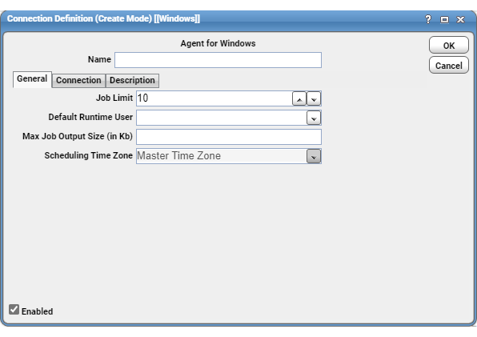

# Defining agent connections

To define a connection between the agent and the TA Master:

1. From the **Navigator** panel of the TA client, choose **Administration > Connections**.
1. From the **Connections** panel, do either of the following:

    - Select the **Add** button on the TA toolbar.
    - Right-click in the **Connections** panel and choose **Add Connection**, then choose the **Agent for Windows** or **Agent for Unix** option from the menu.

    

1. From the **Connection Definition** dialog box, specify a name for the agent you installed.

    !!! note
        This name does not have to match the machine name or instance name.

1. On the General tab, configure:
    - **Job Limit**: Maximum number of jobs you want to run concurrently on this agent. Tidal recommends that you do not run more than 80 jobs at once.
    - **Default Runtime User**: Default runtime user that will appear when creating a new job on this agent.

1. Select the **Enabled** option.
1. On the **Connection** tab, configure:

    - **Machine Name**: Name or IP address of the machine on which the agent is installed. This name must be a valid DNS name.
    - **Master-to-Agent Communication Port**: Agent’s listener port number specified when installing the agent.

1. If you want to enter a description of this agent, select the **Description** tab and enter a description; otherwise, select **OK** to save the connection.
