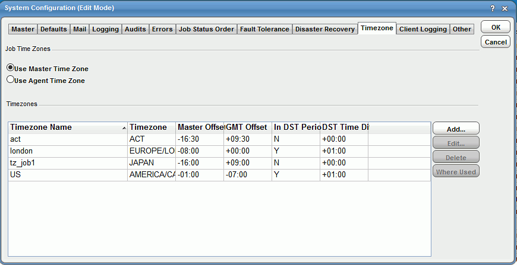
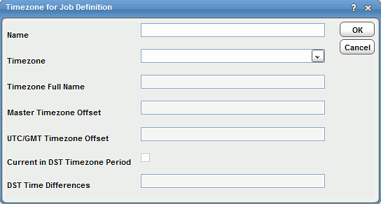
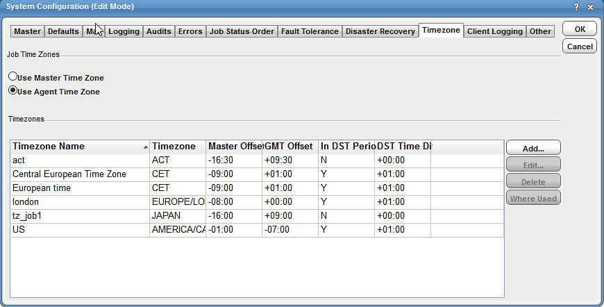
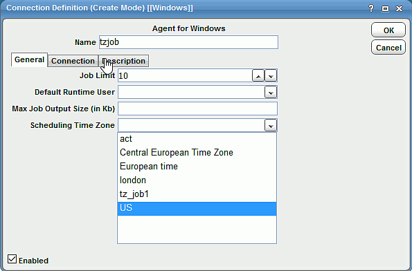

# Modifying agent time zones

You can assign a time zone for agent and adapter connection. By using this new time zone assignment, the TA Master can accurately calculate the time difference between the TA Master instance and the agent without relying on the agent. For example, if the agent time zone is set in Central European Time (CET) and the master time zone is set in Pacific Standard Time (PST), the TA Master would accurately calculate the time difference between the TA Master and the agent. This calculation is further used to adjust the job launch time during Daylight Saving Time (DST).

## Defining an agent time zone
To define an agent time zone:

1. Select **Activities > System Configuration** to open the **System Configuration** dialog box.
1. Navigate to the **Timezone** tab.

    The existing TA Master time zones are displayed.

    

1. From the **Job Time Zones** section, select **Use Agent Time Zone**.
1. Select **Add** to open the **Time Zone for Job Definition** dialog box.

    

1. In the **Name** field, enter a unique name to represent job timezone.
1. From the **Timezone** list, select the timezone ID.

    The following fields are pre-populate depending on the Timezone list selection:

    - **Timezone Full Name**: Java built-in timezone long name.
    - **Master Timezone Offset**: Differences between the TA Master timezone and selected timezone.
    - **UTC/GMT Timezone Offset**: Difference between standard UTC/GMT and the selected timezone.
    - **Current in DST Timezone Period**: Whether the selected timezone is currently in the Daylight Saving Time (DST) period.
    - **DST Time Differences**: Amount of time to be added to selected timezone if it is in DST period.

1. Select **OK**. 

    The new timezone is added to the existing list.

    

1. From the **Navigation** panel, select **Administration > Connections** to display the **Connection Definition** dialog box.

1. In the **Scheduling Time Zone** list field, select the time zone created in the system configuration. This time zone will be used by the agent to trigger the job.

    

    !!! note
        When the **Use Master Time Zone** option is selected in the **System Configuration** dialog box, the **Scheduling Time Zone** list is disabled in the **Connection Definition** dialog box.

1. Navigate to **Administration > Connections** to display the **Connections** panel. 

    The new agent connection is displayed along with the **Scheduling Time Zone** field.

!!! note
    If you change the **Scheduling Time Zone** at the connection level, you must recompile the associated agent and adapter jobs before the new timezone takes effect. Changing the timezone is not supported for agents that are in agent lists.

## Applying agent time zone functionality

The following steps are required for users planning to apply this functionality:

- If you are upgrading to the version with this feature, then first configure the time zone they are scheduling for and then configure the agent connection for them.
- Upgrades should be done when the master and the configured time zone are at least +/- 48 hours from the DST day. Also, recompile future days that are greater than tomorrow.
