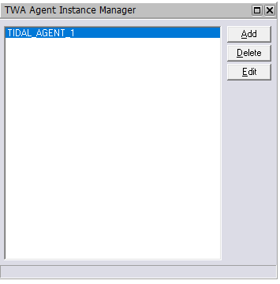
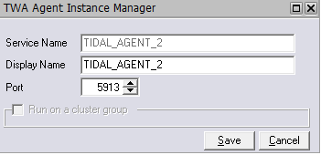
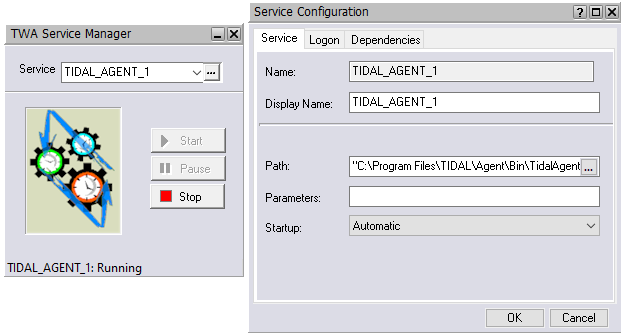
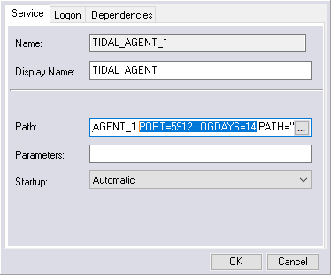

# Configuring Windows agent instances

You can use the Agent Assistance Manager to configure an agent instance by:

- [Adding an agent instance](#addding-an-agent-instances)
- [Modifying an agent instance](#modifying-an-agent-instance)
- [Deleting an agent instance](#deleting-an-agent-instance)
- [Configuring Windows Services for an agent](#configuring-windows-services-for-an-agent)
- [Configuring agent parameters](#configuring-agent-parameters)

## Adding agent instances
To add an instance:

1.  From the Windows __Start__ menu, choose __Programs > Tidal Automation > Agent > Instance Manager__, right click on the __Instance Manager__ and choose “Run as Administrator” to display the Instance Manager.

    

1.  Click __Add__. 

    The following dialog box displays.

    


1.  Enter the following:

    * __Service Name__: Name of the agent service. The name in this field is automatically generated and cannot be edited.

    * __Display Name__: Name of the agent to add. The name in this text field is automatically generated as a possible candidate for the name of your agent. You can keep or change the name.

    * __Port__: Port number the agent uses to listen for Master connections. By default, the TIDAL_AGENT_1 port is 5912. When you add additional agents, the port increments by 1 by default.

    * __Run on a cluster group__: Whether this agent instance is on a node that is configured for a cluster with an existing agent service. If the node is not part of a cluster, this option is unavailable. For more information, see [Configuring the Windows Agent for a Cluster](#configuring-the-windows-agent-for-a-cluster).

1. Click __Save__.

!!! note
    To connect to the agent you just added, see [Defining an Agent Connection](#defining-an-agent-connection).

## Modifying an agent instance
You can modify the port number and the name of the instance that is displayed but the service name cannot be changed.

!!! note
    The __Edit__ button is unavailable as long as the agent is running.

To edit an agent instance:

1.  Stop the agent.

    1.  From the Windows __Start__ menu, choose __All Programs > Tidal Automation > TA Service Manager__ to display the TA Service Manager.

    1.  From the __Services__ list, choose __TIDAL_AGENT_<#>__.

    1.  Click __Stop__.

2.  From the Windows __Start__ menu, choose __Programs > Tidal Automation > Agent > Instance Manager__, right click on the Instance Manager and choose “Run as Administrator” to display the Instance Manager.
3.  Select the instance.
4.  Click __Edit__. 

    The __Edit__ dialog box displays.

5.  Make the necessary edits, then click __Save__. 

    The __Information__ dialog box displays.

6.  Click __OK__.
7.  Re-start the agent.

    1.  From the Windows __Start__ menu, choose __All Programs > Tidal Automation > TA Service Manager__ to display the TA Service Manager.
    1.  From the __Services__ list, choose __TIDAL_AGENT_<#>__.
    1.  Click __Start__.

## Deleting an agent instance
Deleting agent instances does not delete the agent. Even if you delete all of the instances, you must still uninstall the agent program to remove the agent.

!!! note
    The __Delete__ button is unavailable as long as the agent is running.

To delete an instance:

1.  Stop the agent.

    1.  From the Windows __Start__ menu, choose __All Programs > Tidal Automation > TA Service Manager__ to display the TA Service Manager.
    1.  From the __Services__ list, choose __TIDAL_AGENT_<#>__.
    1.  Click __Stop__.

1.  From the Windows __Start__ menu, choose __Programs > Tidal Automation > Agent > Instance Manager__, right click on the __Instance Manager__ and choose “Run as Administrator” to display the Instance Manager.
1.  Select the instance.
1.  Click __Delete__. 

    A confirmation message displays.

1.  Click __Yes__.

!!! attention
    Tidal recommends that you do not delete the last agent instance called __agent_instance_1__. You should instead uninstall the agent program to remove the last agent instance.

To delete an agent through the client, see [Defining an Agent Connection](#defining-an-agent-connection).

## Configuring Windows Services for an agent

After installing or adding agents, you can configure some Windows settings through the Services window, as
documented below, or through the TA Services Manager as discussed in [Verifying the Installation](../windows-install/#verifying-the-installation).

To configure an agent for Windows:

1.  From the Windows __Start__ menu, choose __Settings > Control__ Panel.
1.  Double-click __Administrative Tools__.
1.  Double-click __Services__.
1.  Double-click the agent you just installed.
1.  On the __General__ tab of the __AGENT Properties__ dialog box, select __Stop__ to stop the service.
1.  On the Log On tab, select This Account.
1.  Enter the requested information in the __User Name/Domain Name__ and __Password__ fields, then select __OK__.
1.  Do either of the following:

    * Right-click the agent and choose __Start__.
    * On the __General__ tab, click __Start__ to restart the agent.

1.  Close the __Services__ and __Administrative Tools__ dialog boxes.
1.  Go to the client and follow the [Defining an agent connection](../ta-create-connections/#defining-an-agent-connection) procedure to re-connect the agent.

## Configuring agent parameters
You can configure the parameters of a Windows agent by adding the parameter statements to the Service Manager agent startup parameters or specifying them in the __tagent.ini__ file. If the default location was used during the agent installation, the agent files are located in __C:\Program Files\TIDAL\Agent\Bin__.

### Supported agent configuration parameters

The following table lists the supported configuration parameters. Some parameters can be set only through the Service Manager **Service Configuration Parameter** field, some can be set only in the tagent.ini file, and others can be set in either manner. The Set in column uses the following notations to indicate where a paramter can be set:

-   __INI__: Can be set only in the __tagent.ini__ file
-   __SCP__: Can be set only through the Service Manager
-   __SCP/INI__: Can be set in either manner

    !!! note
        If you set a parameter in both locations, the value defined through the Service Manager takes precedence.


<TABLE>
    <TR>
        <TH ROWSPAN="1" COLSPAN="1">
            <P>
                <A NAME="pgfId-1227725"></A>Parameter</P>
        </TH>
        <TH ROWSPAN="1" COLSPAN="1">
            <P>
                <A NAME="pgfId-1227727"></A>Set in...</P>
        </TH>
        <TH ROWSPAN="1" COLSPAN="1">
            <P>
                <A NAME="pgfId-1227729"></A>Description</P>
        </TH>
    </TR>
    <TR>
        <TD ROWSPAN="1" COLSPAN="1">
            <P>
                <A NAME="pgfId-1227731"></A>agent</P>
        </TD>
        <TD ROWSPAN="1" COLSPAN="1">
            <P>
                <A NAME="pgfId-1227733"></A>SCP</P>
        </TD>
        <TD ROWSPAN="1" COLSPAN="1">
            <P>
                <A NAME="pgfId-1227735"></A>Name of the TA agent</P>
        </TD>
    </TR>
    <TR>
        <TD ROWSPAN="1" COLSPAN="1">
            <P>
                <A NAME="pgfId-1228153"></A>agtresource</P>
        </TD>
        <TD ROWSPAN="1" COLSPAN="1">
            <P>
                <A NAME="pgfId-1228155"></A>INI</P>
        </TD>
        <TD ROWSPAN="1" COLSPAN="1">
            <P>
                <A NAME="pgfId-1228266"></A>Options for monitoring the following agent resources at
                specified time intervals in milliseconds (default=15000):</P>
            <UL>
                <LI CLASS="Cell-Bullet1">
                    <A NAME="pgfId-1228267"></A><b>CPU</b>: Sends agent CPU usage data to the TA Master</LI>
                <LI CLASS="Cell-Bullet1">
                    <A NAME="pgfId-1228268"></A><b>VMEM</b>: Sends agent memory statistics to the TA Master</LI>
            </UL>
            <P>
                <A NAME="pgfId-1228269"></A>Setting this parameter takes the following forms:</P>
            <UL>
                <LI CLASS="Cell-Bullet1">
                    <A NAME="pgfId-1228270"></A><b>agtresource=CPU;VMEM</b>: Montors both resouces at the default 15000 (15-second) intervals.</LI>
                <LI CLASS="Cell-Bullet1">
                    <A NAME="pgfId-1228271"></A><b>agtresource=CPU,10000</b>: Monitors only CPU usage at 10-second intervals.</LI>
                <LI CLASS="Cell-Bullet1">
                    <A NAME="pgfId-1228272"></A><b>agtresource=CPU,10000;VMEM,20000</b>: Monitors CPU usage at 10-second intervals and virtual memory usage at 20-second intervals.</LI>
            </UL>
            <P>
                <A NAME="pgfId-1228157"></A>The minimum interval is 5000 milliseconds, or 5 seconds.
            </P>
        </TD>
    </TR>
    <TR>
        <TD ROWSPAN="1" COLSPAN="1">
            <P>
                <A NAME="pgfId-1227871"></A>cpuload</P>
        </TD>
        <TD ROWSPAN="1" COLSPAN="1">
            <P>
                <A NAME="pgfId-1227873"></A>SCP</P>
        </TD>
        <TD ROWSPAN="1" COLSPAN="1">
            <P>
                <A NAME="pgfId-1227875"></A>Whether to monitor CPU load on the agent. Valid values
                include: <b>Y</b>and <b>N</b> (default).</P>
        </TD>
    </TR>
    <TR>
        <TD ROWSPAN="1" COLSPAN="1">
            <P>
                <A NAME="pgfId-1227737"></A>debug</P>
        </TD>
        <TD ROWSPAN="1" COLSPAN="1">
            <P>
                <A NAME="pgfId-1227739"></A>SCP/INI</P>
        </TD>
        <TD ROWSPAN="1" COLSPAN="1">
            <P>
                <A NAME="pgfId-1229147"></A>Debugging level. Valid values include:</P>
            <UL>
                <LI CLASS="Cell-Bullet1">
                    <A NAME="pgfId-1229148"></A><b>
                        y</b>
                    : Turns on low-level debugging</LI>
                <LI CLASS="Cell-Bullet1">
                    <A NAME="pgfId-1227741"></A><b>
                        high</b>
                    : Turns on maximum-level debugging</LI>
            </UL>
        </TD>
    </TR>
    <TR>
        <TD ROWSPAN="1" COLSPAN="1">
            <P>
                <A NAME="pgfId-1227743"></A>encryptonly</P>
        </TD>
        <TD ROWSPAN="1" COLSPAN="1">
            <P>
                <A NAME="pgfId-1227745"></A>SCP/INI</P>
        </TD>
        <TD ROWSPAN="1" COLSPAN="1">
            <P>
                <A NAME="pgfId-1229175"></A>Whether to disable encrypted connections between agents
                and TA Master instances. Valid values include <b>
                    N</b>
                (default) and <b>
                    Y</b>
                .</P>
        </TD>
    </TR>
    <TR>
        <TD ROWSPAN="1" COLSPAN="1">
            <P>
                <A NAME="pgfId-1227749"></A>filelockcheck</P>
        </TD>
        <TD ROWSPAN="1" COLSPAN="1">
            <P>
                <A NAME="pgfId-1227751"></A>SCP/INI</P>
        </TD>
        <TD ROWSPAN="1" COLSPAN="1">
            <P>
                <A NAME="pgfId-1227753"></A>Whether the directory monitoring job should skip files
                that are opened by another process to avoid potential access conflicts. Valid values
                include: <b>
                    Y</b>
                (default) and <b>
                    N</b>
                .</P>
        </TD>
    </TR>
    <TR>
        <TD ROWSPAN="1" COLSPAN="1">
            <P>
                <A NAME="pgfId-1227755"></A>folderdep</P>
        </TD>
        <TD ROWSPAN="1" COLSPAN="1">
            <P>
                <A NAME="pgfId-1227757"></A>SCP/INI</P>
        </TD>
        <TD ROWSPAN="1" COLSPAN="1">
            <P>
                <A NAME="pgfId-1227759"></A>Whether the file monitoring job should monitor
                directories. Valid values include: <b>
                    Y</b>
                and <b>
                    N</b>
                (default).</P>
        </TD>
    </TR>
    <TR>
        <TD ROWSPAN="1" COLSPAN="1">
            <P>
                <A NAME="pgfId-1227929"></A>ftptimeout</P>
        </TD>
        <TD ROWSPAN="1" COLSPAN="1">
            <P>
                <A NAME="pgfId-1227931"></A>INI</P>
        </TD>
        <TD ROWSPAN="1" COLSPAN="1">
            <P>
                <A NAME="pgfId-1227933"></A>Timeout, in milliseconds, for an FTP connection. Default
                is 120000 (two minutes). Setting the value to 0 results in no timeout for the
                connection.</P>
        </TD>
    </TR>
    <TR>
        <TD ROWSPAN="1" COLSPAN="1">
            <P>
                <A NAME="pgfId-1227923"></A>logdays</P>
        </TD>
        <TD ROWSPAN="1" COLSPAN="1">
            <P>
                <A NAME="pgfId-1227925"></A>SCP/INI</P>
        </TD>
        <TD ROWSPAN="1" COLSPAN="1">
            <P>
                <A NAME="pgfId-1227927"></A>Number of days to preserve logs. Default: 7.</P>
        </TD>
    </TR>
    <TR>
        <TD ROWSPAN="1" COLSPAN="1">
            <P>
                <A NAME="pgfId-1227917"></A>logsize</P>
        </TD>
        <TD ROWSPAN="1" COLSPAN="1">
            <P>
                <A NAME="pgfId-1227919"></A>SCP/INI</P>
        </TD>
        <TD ROWSPAN="1" COLSPAN="1">
            <P>
                <A NAME="pgfId-1227921"></A>Maximum size, in bytes, of log files. Default: 1024000.
            </P>
        </TD>
    </TR>
    <TR>
        <TD ROWSPAN="1" COLSPAN="1">
            <P>
                <A NAME="pgfId-1227911"></A>msgthreads</P>
        </TD>
        <TD ROWSPAN="1" COLSPAN="1">
            <P>
                <A NAME="pgfId-1227913"></A>SCP</P>
        </TD>
        <TD ROWSPAN="1" COLSPAN="1">
            <P>
                <A NAME="pgfId-1229255"></A>Number of CPU threads to devote to messages. Default: 5.
            </P>
            <P>
                <A NAME="pgfId-1229256"></A>Tidal recommends using the default value for machines
                with one or two CPUs. If a machine has more CPUs, you might want to increase the
                thread count to improve performance.</P>
        </TD>
    </TR>
    <TR>
        <TD ROWSPAN="1" COLSPAN="1">
            <P>
                <A NAME="pgfId-1227905"></A>multiftpstd</P>
        </TD>
        <TD ROWSPAN="1" COLSPAN="1">
            <P>
                <A NAME="pgfId-1227907"></A>INI</P>
        </TD>
        <TD ROWSPAN="1" COLSPAN="1">
            <P>
                <A NAME="pgfId-1229344"></A>How to handle FTP multi-file MGET, MPUT, or MDELETE
                actions that operate on no files. Values include:</P>
            <UL>
                <LI CLASS="Cell-Bullet1">
                    <A NAME="pgfId-1229345"></A><b>
                        Y</b>
                    (default): Allow the job to complete without reporting errors.</LI>
                <LI CLASS="Cell-Bullet1">
                    <A NAME="pgfId-1227909"></A><b>
                        N</b>
                    : Allow the job to complete abnormally if the actions operated on no files.</LI>
            </UL>
        </TD>
    </TR>
    <TR>
        <TD ROWSPAN="1" COLSPAN="1">
            <P>
                <A NAME="pgfId-1228191"></A>path</P>
        </TD>
        <TD ROWSPAN="1" COLSPAN="1">
            <P>
                <A NAME="pgfId-1228193"></A>SCP</P>
        </TD>
        <TD ROWSPAN="1" COLSPAN="1">
            <P>
                <A NAME="pgfId-1228195"></A>Directory for the agent’s ouptut. By default, output is
                stored in the agent’s root directory.</P>
        </TD>
    </TR>
    <TR>
        <TD ROWSPAN="1" COLSPAN="1">
            <P>
                <A NAME="pgfId-1228206"></A>port</P>
        </TD>
        <TD ROWSPAN="1" COLSPAN="1">
            <P>
                <A NAME="pgfId-1228208"></A>SCP</P>
        </TD>
        <TD ROWSPAN="1" COLSPAN="1">
            <P>
                <A NAME="pgfId-1228210"></A>Port number through which the TA Master communicates
                with the agent.</P>
        </TD>
    </TR>
    <TR>
        <TD ROWSPAN="1" COLSPAN="1">
            <P>
                <A NAME="pgfId-1228220"></A>rjaport</P>
        </TD>
        <TD ROWSPAN="1" COLSPAN="1">
            <P>
                <A NAME="pgfId-1228222"></A>SCP</P>
        </TD>
        <TD ROWSPAN="1" COLSPAN="1">
            <P>
                <A NAME="pgfId-1228224"></A>Remote job port number.</P>
            <P>
                <A NAME="pgfId-1232459"></A>You can specify two ports by using the form: <EM
                    CLASS="I-Italic">
                    port1</b>
                :<EM CLASS="I-Italic">
                    port2</b>
                .</P>
        </TD>
    </TR>
    <TR>
        <TD ROWSPAN="1" COLSPAN="1">
            <P>
                <A NAME="pgfId-1228057"></A>sftpparallemode</P>
        </TD>
        <TD ROWSPAN="1" COLSPAN="1">
            <P>
                <A NAME="pgfId-1228059"></A>INI</P>
        </TD>
        <TD ROWSPAN="1" COLSPAN="1">
            <P>
                <A NAME="pgfId-1229373"></A>Whether secure FTP file transfers (upload and download
                operations) can run in parallel. Valid values include:</P>
            <UL>
                <LI CLASS="Cell-Bullet1">
                    <A NAME="pgfId-1229374"></A><b>
                        Y</b>
                    (default): File transers can run simultaneously (in parallel).</LI>
                <LI CLASS="Cell-Bullet1">
                    <A NAME="pgfId-1228061"></A><b>
                        N</b>
                    : File transfers are sent sequentially.</LI>
            </UL>
        </TD>
    </TR>
    <TR>
        <TD ROWSPAN="1" COLSPAN="1">
            <P>
                <A NAME="pgfId-1228051"></A>sftpumask</P>
        </TD>
        <TD ROWSPAN="1" COLSPAN="1">
            <P>
                <A NAME="pgfId-1228053"></A>INI</P>
        </TD>
        <TD ROWSPAN="1" COLSPAN="1">
            <P>
                <A NAME="pgfId-1228055"></A>Permission mask (4-digit octal) for files created on a
                Unix-based system with the <b>
                    SFTP PUT</b>
                actions. Default=<b>
                    0022</b>
                .</P>
        </TD>
    </TR>
    <TR>
        <TD ROWSPAN="1" COLSPAN="1">
            <P>
                <A NAME="pgfId-1228045"></A>sslvldcrt</P>
        </TD>
        <TD ROWSPAN="1" COLSPAN="1">
            <P>
                <A NAME="pgfId-1228047"></A>SCP/INI</P>
        </TD>
        <TD ROWSPAN="1" COLSPAN="1">
            <P>
                <A NAME="pgfId-1228049"></A>Whether to validate SSL certificate validation by Tidal
                Automation agents. Default=<b>
                    Y</b>
                .</P>
        </TD>
    </TR>
    <TR>
        <TD ROWSPAN="1" COLSPAN="1">
            <P>
                <A NAME="pgfId-1228039"></A>stdout</P>
        </TD>
        <TD ROWSPAN="1" COLSPAN="1">
            <P>
                <A NAME="pgfId-1228041"></A>SCP/INI</P>
        </TD>
        <TD ROWSPAN="1" COLSPAN="1">
            <P>
                <A NAME="pgfId-1228043"></A>Whether to send output messages to standard output
                (console) in addition to log files. Valid values include: <b>
                    Y</b>
                and <b>
                    N</b>
                (default).</P>
        </TD>
    </TR>
    <TR>
        <TD ROWSPAN="1" COLSPAN="1">
            <P>
                <A NAME="pgfId-1228033"></A>substticks</P>
        </TD>
        <TD ROWSPAN="1" COLSPAN="1">
            <P>
                <A NAME="pgfId-1228035"></A>INI</P>
        </TD>
        <TD ROWSPAN="1" COLSPAN="1">
            <P>
                <A NAME="pgfId-1228037"></A>Whether to substitute single quotes (‘) with double
                quotes (“) in strings. Valid values include: <b>
                    Y</b>
                and <b>
                    N</b>
                (default).</P>
        </TD>
    </TR>
</TABLE>


### Setting configuration parameters through the Service Manager

To set configuration parameters through the Service Manager:

1. From the Windows **Start** menu, start the Service Manager.
1. Stop the agent if it is running.
1. In the **Service** field, select the desired agent and select the  button.

    The agent’s **Service Configuration** dialog box opens.

    

1. In the **Path** field, enter the [parameter and value pairs](#supported-agent-configuration-parameters) you want to define.

    


    !!! note
        Any parameters specified in the **Path** field take precedence over anything specified in the **tagent.ini** file.

1. Select **OK**.
1. Restart the agent.


### Setting configuration parameters in the tagent.ini file

The **tagent.ini** file in the bin directory lets you configure global configuration parameters and configure parameters for individual agents. The file contains a `[config]` section and an `[<Agent-Name>]` section for each agent you want to configure. The parameters specified in the `[config]` section are global and the parameters specified in the `[<Agent-Name>]` section only apply to that agent and will override specifications in the `[config]` section for the specific agent.

Following is an example of a **tagent.ini** file:

````````
[config]
debug=y
logdays=3
logsize=1024000
encryptonly=y
sslvldcrt=y
vldhstcrt=y this is a synonym for sslvldcrt, as host validation also applies to SSH (only works in tagent.ini)

[TIDAL_AGENT_1]
debug=high
logdays=5
logsize=2048000
encryptonly=n
vldhstcrt=n
````````

To set configuration parameters in the tagent.ini file:

1. Open the **tagent.ini** file in the agent’s **bin** directory.
2. Add [global and agent-specifc parameters](#supported-agent-configuration-parameters) as desired.
3. Save the file.
4. From the Windows **Start** menu, start the Service Manager.
5. Start, or stop and restart, the agent.